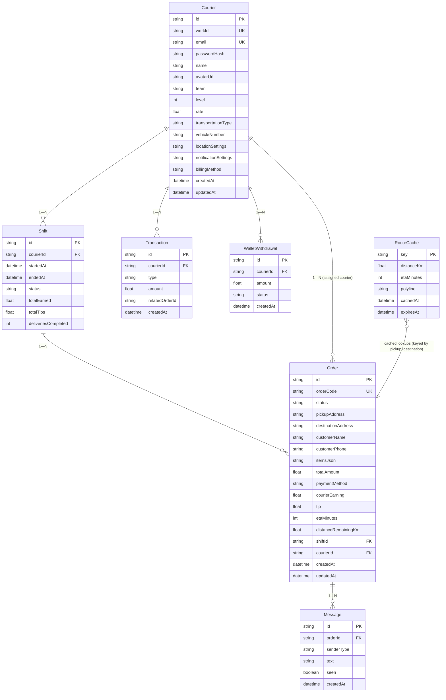

# Delivery Buddy — Entity Relationship Diagram

## Mermaid Diagram

## Relationships Summary

| Relationship | Cardinality | Notes |
|---|---|---|
| Courier → Shift | 1 — N | A courier can have many shifts over time; only one active at a time. |
| Shift → Order | 1 — N | Orders are assigned to a shift. The active shift holds current + queued deliveries. |
| Courier → Transaction | 1 — N | Every earning, tip, and withdrawal is recorded as a ledger entry. |
| Courier → WalletWithdrawal | 1 — N | Withdrawal requests made by the courier. |
| Courier → Order | 1 — N | Orders are assigned to a specific courier. |
| Order → Message | 1 — N | Chat messages tied to a specific order/delivery. |
| RouteCache → (lookup) | — | Not a direct FK relationship; keyed by pickup+destination pair, referenced when computing routes for orders. |

## Enum Values

- **Courier.transportationType**: `bicycle` | `car` | `truck`
- **Shift.status**: `active` | `ended`
- **Order.status**: `assigned` | `in_transit` | `at_door` | `delivered` | `cancelled`
- **Order.paymentMethod**: `credit_card` | `cash` | `debit_card` | `wallet`
- **Transaction.type**: `earning` | `tip` | `withdrawal`
- **WalletWithdrawal.status**: `pending` | `completed` | `failed`
- **Message.senderType**: `courier` | `customer`
