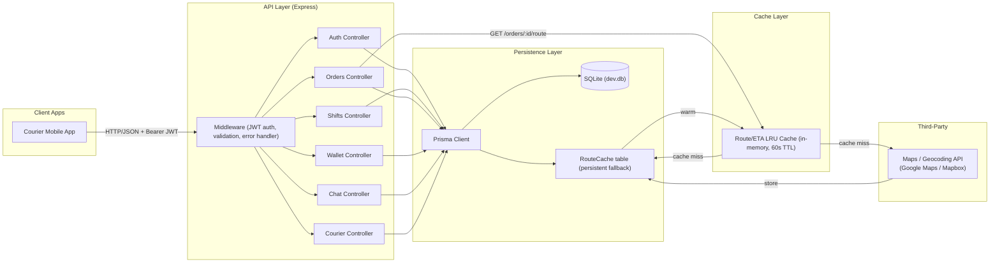

# Delivery Buddy — Architecture

## Overview

Delivery Buddy is a courier-facing backend API built with **Node.js + Express + TypeScript**.
It persists data in **SQLite via Prisma** and uses an **in-memory LRU cache** for hot
route/ETA lookups to avoid redundant calls to the third-party maps provider.

## Component Diagram



## Layer Responsibilities

### 1. Client Layer
The courier mobile app communicates over HTTP/JSON. All protected endpoints
require a `Authorization: Bearer <JWT>` header.

### 2. API Layer (Express)
- **Middleware pipeline**: CORS → JSON body parser → request logging (morgan) →
  JWT authentication → Zod validation → route handler → error handler.
- **Controllers** map to domain areas: auth, couriers, shifts, orders, wallet, chat.
- **Validation**: Zod schemas validate every request body/params/query before
  reaching the controller. Validation errors return `400` with structured details.
- **Error handling**: A centralized error handler converts `HttpError`, `ZodError`,
  and Prisma `P2025` (not found) into consistent JSON responses.

### 3. Cache Layer
- **In-memory LRU cache** (`lru-cache`) with a 60-second TTL stores route/ETA
  lookups keyed by `pickup||destination`.
- On a cache miss, the system checks the **RouteCache table** in SQLite (a
  persistent fallback that survives process restarts). If that is also stale,
  it calls the maps provider, stores the result in both the LRU cache and the
  RouteCache table, then returns.
- This three-tier strategy (memory → DB → provider) ensures repeated polling
  from the live-tracking screen never re-hits the third-party API within the TTL.

### 4. Persistence Layer
- **Prisma ORM** maps TypeScript models to SQLite tables.
- SQLite is used for its zero-config, file-based simplicity — appropriate for
  this scope. The schema is defined in `prisma/schema.prisma`.
- Migrations are applied via `prisma db push`.

### 5. Third-Party Services
- **Maps / Geocoding API**: In production, this would be Google Maps or Mapbox.
  For this assessment, a `mockRouteLookup` function deterministically derives
  distance and ETA from address strings, simulating a real provider's response.
  The mock is swappable behind the `getRoute()` service interface.

## Authentication Flow

```
signup → bcrypt hash password → store Courier → sign JWT → return token
login  → bcrypt compare       → verify      → sign JWT → return token
[protected routes] → middleware verifies JWT → attaches courierId to request
logout → stateless (client discards token)
```

## Wallet Balance Computation

The wallet balance is **derived**, not stored. It is computed as:

```
balance = SUM(earning + tip transactions) − SUM(withdrawal transactions)
```

This ensures the ledger is the single source of truth and cannot drift from
a cached balance field. The `GET /wallet` endpoint computes this on each call
(two aggregate queries — cheap at this scale).

## Request Lifecycle (example: GET /orders/:id/route)

```
1. Request arrives with Bearer JWT
2. authMiddleware verifies token, loads courier
3. validateParams checks orderId
4. orderController.getOrderRoute:
   a. Fetch order from DB (404 if not found / not owned)
   b. getRoute(pickup, destination):
      i.   Check LRU memory cache → hit? return (fromCache: true)
      ii.  Check RouteCache table → fresh? populate LRU, return
      iii. Call mockRouteLookup → store in LRU + RouteCache table → return
   c. Update order's etaMinutes + distanceRemainingKm
   d. Return route info
5. If any error thrown → errorHandler formats response
```
